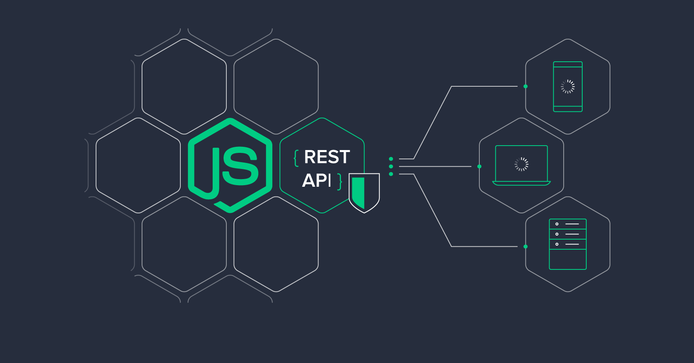

# DevCamper - Bootcamp Directory API

> An extensive Bootcamp Finder API built using Node.js, Express and MongoDB. It was built as a part of the Node.js API Masterclass by Brad Traversy.



## Features

The API includes **32** different routes handling functionality from **Bootcamps**, **Courses**, and **Reviews**. Separate functionality for **Admins** is also included. Here is a break down of the functionality by each different resource:

### Bootcamps

- List all bootcamps in the database
  - Pagination
  - Select specific fields in result
  - Limit the number of results
  - Filter by fields
- Search bootcamps by radius from zipcode
  - Use a geocoder to get exact location and coordinates from a single address field
- Get single bootcamp
- Create new bootcamp
  - Authenticated users only
  - Must have the role "publisher" or "admin"
  - Only one bootcamp per publisher (admins can create more)
  - Field validation via Mongoose
- Upload a photo for bootcamp
  - Owner of the bootcamp allowed to upload photo
  - Photo will be uploaded to local filesystem
- Update bootcamps
  - Owner of the bootcamp only
  - Validation on update
- Delete Bootcamp
  - Owner only
- Calculate the average cost of all courses for a bootcamp
- Calculate the average rating from the reviews for a bootcamp

### Courses

- List all courses for bootcamp
- List all courses in general
  - Pagination
  - Select specific fields in result
  - Limit the number of results
  - Filter by fields
- Get single course
- Create new course
  - Authenticated users only
  - Must have the role "publisher" or "admin"
  - Only the owner or an admin can create a course for a bootcamp
  - Publishers can create multiple courses
- Update course
  - Owner only
- Delete course
  - Owner only

### Reviews

- List all reviews for a bootcamp
- List all reviews in general
  - Pagination
  - Select specific fields in result
  - Limit the number of results
  - Filter by fields
- Get a single review
- Create a review
  - Authenticated users only
  - Must have the role "user" or "admin" (no publishers)
- Update review
  - Owner only
- Delete review
  - Owner only

### Users & Authentication

- Authentication will be ton using JWT/cookies
  - JWT and cookie should expire in 30 days
- User registration
  - Register as a "user" or "publisher"
  - Once registered, a token will be sent along with a cookie
  - Passwords must be hashed
- User login
  - User can login with email and password
  - Plain text password will compare with stored hashed password
  - Once logged in, a token will be sent along with a cookie
- User logout
  - Cookie will be sent to set token = none
- Get user
  - Route to get the currently logged in user (via token)
- Password reset (lost password)
  - User can request to reset password
  - A hashed token will be emailed to the users registered email address
  - A put request can be made to the generated url to reset password
  - The token will expire after 10 minutes
- Update user info
  - Authenticated user only
  - Separate route to update password
- User CRUD
  - Admin only

**Note:**<br/>
_Users can only be made admin by updating the database field manually_

## NPM Packages Used

| Package Name           | Usage                                                            |
| ---------------------- | ---------------------------------------------------------------- |
| Express                | Backend framework for Node.js                                    |
| Nodemon                | Run in dev environment with features like hot reload             |
| Dotenv                 | For configuration of environmental variables                     |
| Morgan                 | Logging Requests                                                 |
| Mongoose               | ODM library for MongoDB and Node.js                              |
| Colors                 | Add colours to the console outputs                               |
| Slugify                | Slugify strings for URLs                                         |
| Node Geocoder          | Geocoding library for Node.js to extract location from addresses |
| Express Fileupload     | Uploading files in Node.js                                       |
| JsonWebToken           | jsonwebtokens for Node.js                                        |
| Bcryptsjs              | Password hashing                                                 |
| NodeMailer             | Sending email in Node.js                                         |
| Express Mongo Sanitize | Prevent NoSQL injections                                         |
| Helmet                 | Add security headers                                             |
| XSS                    | Prevent cross site scripting                                     |
| Express Rate Limiter   | Limit request rate for the API                                   |
| Hpp                    | Prevent http param pollution                                     |
| Cors                   | Enable CORS in Node.js                                           |

## What I Learned in this course

This is a very comprehensive course on API development using Node.js and Express. While working on this course I learned the following concepts:

- Creating basic Node and Express server.
- Using nodemon for development of the API.
- Using Express router.
- Separating functionality into controller methods.
- Understanding how middleware works.
- Fundamentals concepts of NoSQL databases like MongoDB.
- CRUD Operations.
- Creating custom middleware.
- Extensive error handling. using custom classes and middleware.
- Learning about async/await. in Node.js.
- Using GeoJSON and MapQuest API.
- Writing a geospatial query in MongoDB.
- Learning about API concepts like pagination, sorting and filtering.
- Creating a database seeder.
- Learning how to authenticate using JWT.
- Storing JWT in cookies.
- Using concepts like aggregate in MongoDB.
- Learning how to make API secure.
- Using Postman and docgen to generate API documentation.
- Learning to deploy a full fledged API to DigitalOcean.
- Learn things like SSH and droplets, reverse proxy and nginx.
- Using Postman for testing the API and try features like collections and environments.

## API Security

Following security features are implemented in this API 🔐:

- Encrypt passwords and reset tokens
- Prevent NoSQL injections
- Add headers for security (helmet)
- Prevent cross site scripting - XSS
- Add a rate limit for requests of 100 requests per 10 minutes
- Protect against http param polution
- Use cors to make API public

## Usage

**Node.js** must be installed on your machine. **npm** is automatically installed with Node.js. In order to install Node.js please visit their [Official Website](https://nodejs.org/en/).

Check Node.js version:

```
node --version
```

Check npm version:

```
npm --version
```

## Configuring the Environment

To configure the environment, follow these steps: 🌳

- In the config folder, there is a `config.env.env` starter configuration file.
- Rename the file to `config.env`.
- All the environment variables required are already present in the config file.
- Before running the application, just add your own environment variable values and you're good to go.

## Installing Dependencies

```
npm install
```

## Seeding the Database

In order to seed the database, all you have to do is run the seeder.js file using node. All data is present in the `_data` folder in json file format.

### Add records to database

Add the records i.e. bootcamps, courses, reviews and users from the `_data` folder to the database:

```
node seeder -i
```

### Remove records from database

Remove records i.e. bootcamps, courses, reviews and users from database:

```
node seeder -d
```

Now you are ready to run the application locally.

## Running Locally

Once the environment is setup and dependencies are installed, you can run the application locally.

### Run in Production Environment

Run the application in production environment:

```
npm start
```

### Run in Development Environment

In order to run the application in development mode using **nodemon**:

```
npm run dev
```

The application will start in dev mode and the server will reload once you make changes.

## Deploying to DigitalOcean

If you wish to deploy the application you have to follow the following steps:

- Create an Account on DigitalOcean. Use the affiliate link by Brad Traversy to get \$10 credit: https://m.do.co/c/5424d440c63a
- Push the respository to GitHub
- Create a droplet on DigitalOcean
- Clone the repository on the created droplet.
- Use PM2 process manager to configure server autostart and management
- Create an NGINX reverse proxy for port 80
- Connect a domain name
- Install an SSL using Let's Encrypt

For detailed guide to deploying Node.js applications to DigitalOcean please refer to this [guide](https://gist.github.com/bradtraversy/cd90d1ed3c462fe3bddd11bf8953a896) by Brad Traversy.

## Generating Documentation

For this project, Postman is used for testing the API. The documentation is generated as follows:

- Use Postman to create documentation of the API
- Use docgen to create HTML files from Postman collection
- Add html files as the / route for the API so the index page of the API shows the complete description of all the routes.

## Version

The project is at version **1.0**. It was built as a course project to learn about making REST APIs in Node and Express and therefore, will not be updated.

## Helpful Resources

- [DevCamper project Brad Traversy](https://github.com/bradtraversy/devcamper-api)
- [DevCamper Specs Gist By Brad Traversy](https://gist.github.com/bradtraversy/01adb248df70fb29e98c30cf659042cf)
- [DevCamper Deployment Gist By Brad Traversy](https://gist.github.com/bradtraversy/cd90d1ed3c462fe3bddd11bf8953a896)
- [Node.js Course for this project](https://www.udemy.com/course/nodejs-api-masterclass/)

## Credits

Thanks to [@bradtraversy](https://github.com/bradtraversy) for this amazing course. 🙏

## License

[MIT](LICENSE)
